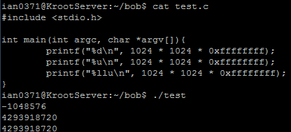
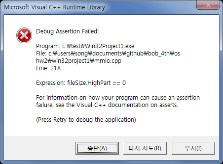
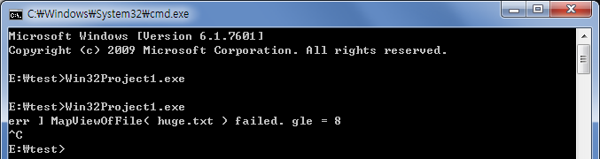
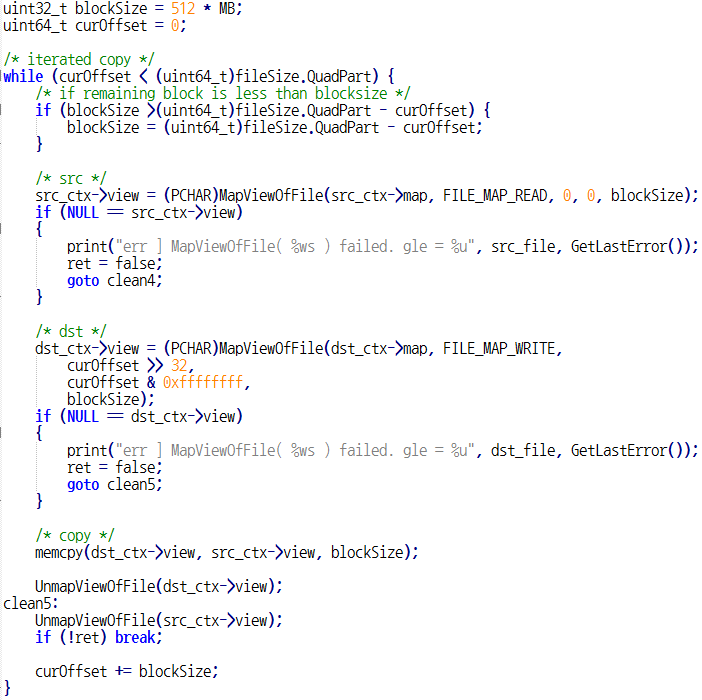
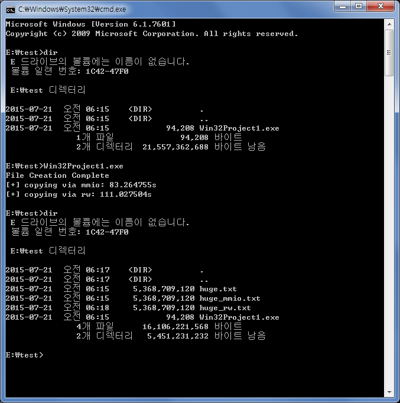

왜 create_very_big_file로는 파일 크기가 4GB 혹은 그 이상인 파일을 만들 수 없을까?
그 이유는 바로 함수의 인자형에 있는데, 이 함수의 2번째 인자는 uint32_t형이다. 이는 0xffffffff(약 4.2GB)까지의 정보만 저장할 수 있다.
또한
file_size.QuadPart = (1024 * 1024) * size_in_mb;
이 부분에서 1024 * 1024 * 0xffffffff를 하게 되면 모두 32-bit형이므로 오버플로우가 일어난다. 

 

따라서 64-bit형으로 casting이 필요하다.

memory mapped I/O로 위와 같은 큰 파일이 복사되지 않는 이유는 Error 창을 보면 알 수 있다.  

 

에러가 나는 코드를 살펴보면 다음과 같다.
_ASSERTE(fileSize.HighPart == 0);
LARGE_INTEGER의 HighPart를 0으로 설정해줘서 assertion error가 뜨는 것이다.

이를 없애면 제대로 되는지 확인해보자. 

 

MapViewOfFile에서 에러가나며 중지된다.
위 함수가 4GB가 넘는 Memory Map을 생성할 수 없기 때문이다.

따라서 큰 파일을 한꺼번에 통째로 옮기지 말고, 블록으로 쪼개서 블록마다 옮기는 방식을 취해야한다. 

 

curOffset에서 blockSize(램부족문제로 512MB로 설정)만큼 block을 이동하면서 MapViewOfFile을 호출해서 copy를 진행하고, 남은 block을 copy한다.
실행한 결과는 다음과 같다. 

 

외장하드 메모리부족으로 5GB밖에 테스트하지 못하였다.

Q. 왜 do { } while(false)를 사용하는지?